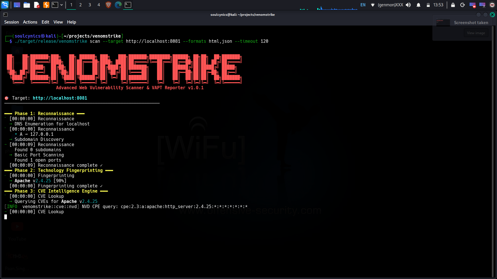
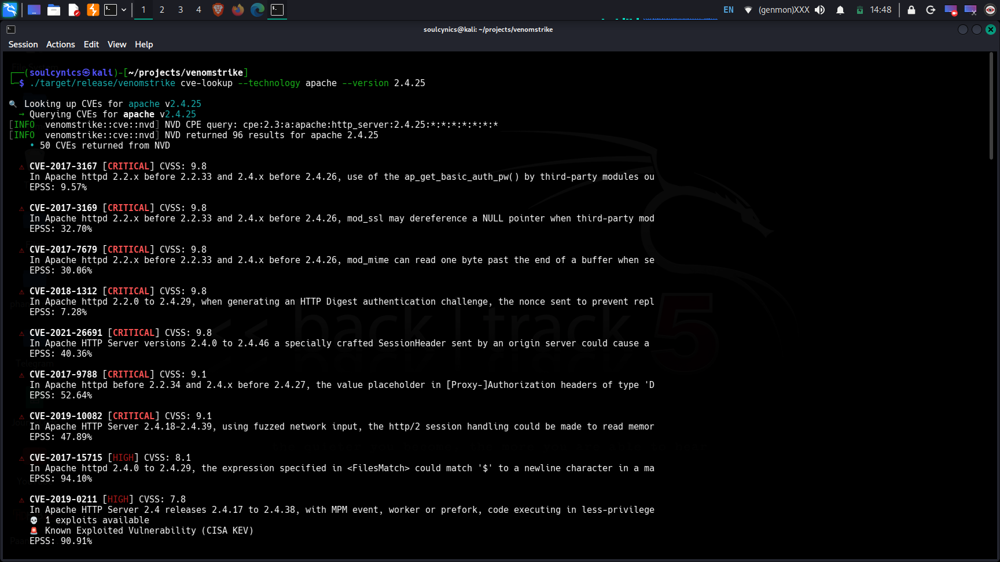
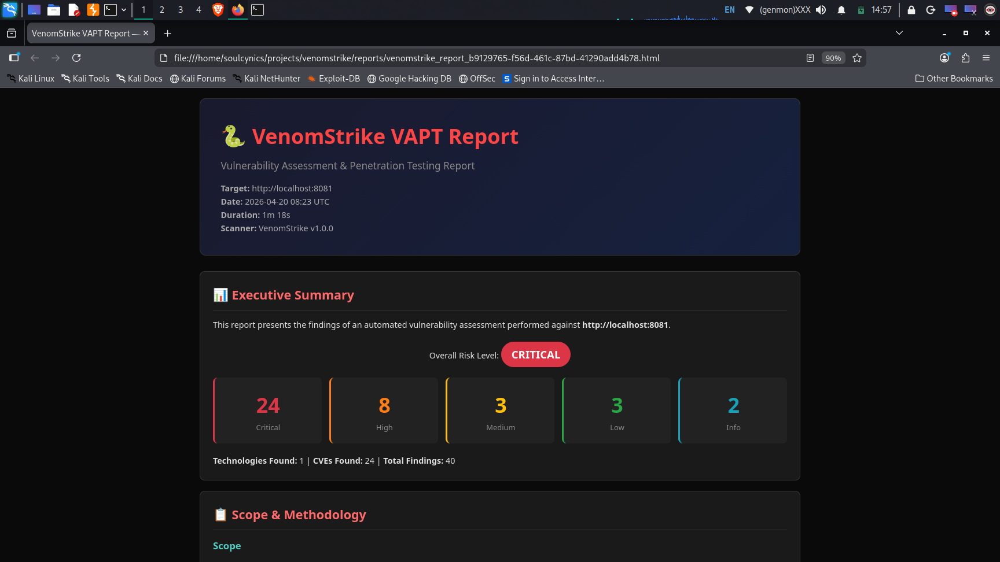
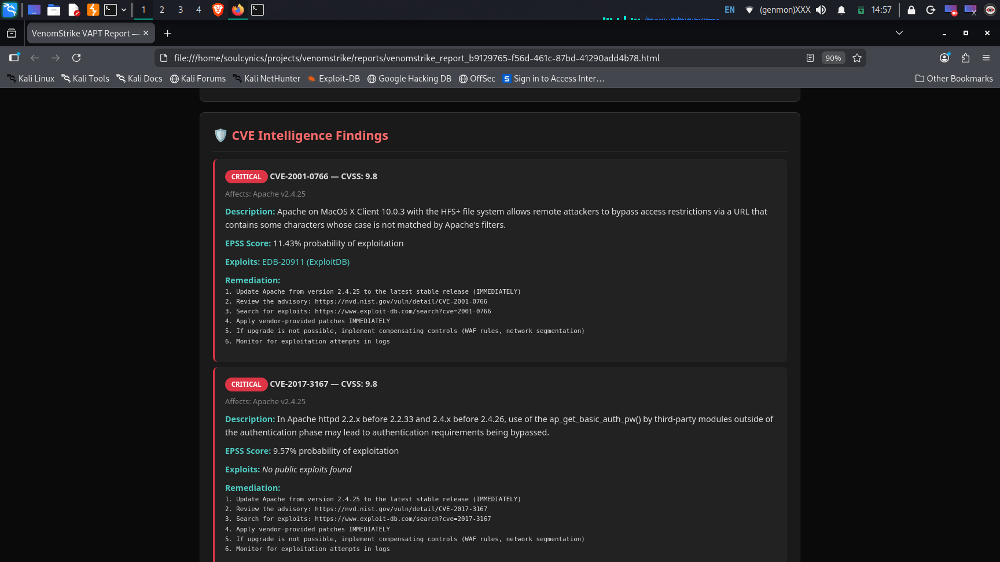

<div align="center">

# 🐍 VenomStrike

### Advanced Web Vulnerability Scanner & VAPT Reporter

[](https://www.rust-lang.org/)
[](LICENSE)
[](https://github.com/Soulcynics404/venomstrike/releases)
[](https://github.com/Soulcynics404/venomstrike/stargazers)

**A comprehensive command-line web vulnerability scanner built from scratch in Rust that performs automated security assessments across 5 phases and generates professional VAPT reports.**

*No external scanner wrappers. 100% custom-built detection engine with async multi-threaded architecture.*

[Quick Start](#quick-start) | [Screenshots](#screenshots) | [Features](#features) | [Architecture](#architecture) | [Reports](#report-formats) | [Contributing](#contributing)

</div>

---

## 📸 Screenshots

<div align="center">
<table>
<tr>
<td align="center" width="50%">

**🔍 Terminal Scan Output**



</td>
<td align="center" width="50%">

**CVE Intelligence Engine**



</td>
</tr>
<tr>
<td align="center" width="50%">

**VAPT Report - Executive Summary**



</td>
<td align="center" width="50%">

**VAPT Report - Vulnerability Details**



</td>
</tr>
</table>
</div>

---

## ✨ Features

### 🚀 5-Phase Scanning Pipeline

| Phase | Name | What It Does |
|-------|------|-------------|
| 1 | **Reconnaissance** | DNS enumeration, subdomain discovery, port scanning (optional Nmap) |
| 2 | **Fingerprinting** | Web server, CMS, JS libraries, WAF detection |
| 3 | **CVE Intelligence** | NVD API 2.0 + ExploitDB + EPSS scores + CISA KEV catalog |
| 4 | **Active Scanning** | Custom-built scanners for 11+ vulnerability types |
| 5 | **VAPT Reporting** | HTML, JSON, PDF, and SARIF report generation |

### Custom-Built Vulnerability Scanners

| Scanner | Detection Methods | Severity |
|---------|------------------|----------|
| SQL Injection | Error-based, Boolean-blind, Time-based | Critical |
| Cross-Site Scripting | Reflected XSS with encoding bypass | High |
| SSRF | Internal network, Cloud metadata, Protocol smuggling | High |
| LFI/RFI | Path traversal, PHP wrappers, Log poisoning | Critical |
| SSTI | Jinja2, Twig, FreeMarker, ERB detection | Critical |
| Command Injection | Separator-based, Time-based, Nested | Critical |
| CORS Misconfiguration | Origin reflection, Null origin, Prefix bypass | Medium |
| Open Redirect | URL parsing bypass, Protocol-relative | Medium |
| CSRF Detection | Missing tokens, SameSite analysis | Medium |
| Security Headers | 10+ header checks (HSTS, CSP, X-Frame, etc.) | Medium |
| SSL/TLS | Certificate validation, Expiry, Protocol checks | High |

### CVE Intelligence Engine

For each detected technology, VenomStrike queries multiple intelligence sources:

- **NIST NVD API 2.0** with proper CPE string mapping
- **ExploitDB** local CSV database for available exploits
- **EPSS Scores** from FIRST.org showing exploitation probability
- **CISA KEV Catalog** for known exploited vulnerabilities

Each CVE finding includes CVE ID, CVSS Score, description, available exploits with ExploitDB links, EPSS probability, CISAKEV status, and prioritized remediation steps.

---

## 📁 Report Formats

| Format | Purpose | Use Case |
|--------|---------|----------|
| **HTML** | Interactive dark-themed report | Client presentations |
| **JSON** | Machine-readable structured data | CI/CD pipelines |
| **PDF** | Professional printable document | Formal deliverables |
| **SARIF** | GitHub Security tab integration | DevSecOps |

Report highlights include executive summary, all findings sorted by severity, exact payload that found each bug highlighted in red, CVE references with exploit links, and prioritized remediation roadmap.

---

## Quick Start

Rust 1.70+ and OpenSSL dev libraries required.

```bash
git clone https://github.com/Soulcynics404/venomstrike.git
cd venomstrike
sudo apt install -y build-essential pkg-config libssl-dev
cargo build --release
```

Full scan:

```bash
./target/release/venomstrike scan --target https://example.com --formats html,json,sarif
```

CVE lookup:

```bash
./target/release/venomstrike cve-lookup --technology apache --version 2.4.25
```

Advanced:

```bash
./target/release/venomstrike scan \
    --target https://example.com \
    --threads 20 \
    --rate-limit 15 \
    --phases recon,fingerprint,cve,active,report \
    --formats html,json,pdf,sarif \
    --nmap \
    --nvd-key YOUR_NVD_API_KEY \
    --verbose
```

Docker:

```bash
docker build -t venomstrike .
docker run venomstrike scan --target https://example.com
```

---

## Architecture

```
venomstrike/
  src/
    main.rs              Entry point and CLI routing
    core/                Engine, crawler, rate limiter, scope, session
    recon/               Phase 1: DNS, subdomains, ports
    fingerprint/         Phase 2: Server, CMS, WAF, tech
    cve/                 Phase 3: NVD, ExploitDB, EPSS, KEV
    scanners/            Phase 4: SQLi, XSS, SSRF, LFI, SSTI, CMDi, etc.
    reporting/           Phase 5: HTML, JSON, PDF, SARIF
  payloads/              External payload files
  config/                Configuration files
  tests/                 Integration and unit tests
```

### Plugin Architecture

Adding a new scanner requires implementing one trait and registering it in mod.rs.

---

## Configuration

| Option | Description | Default |
|--------|-------------|---------|
| --target | Target URL | Required |
| --threads | Concurrent threads | 10 |
| --rate-limit | Requests per second | 10 |
| --phases | Scan phases to run | all |
| --formats | Report formats | html,json |
| --nmap | Enable Nmap port scanning | false |
| --nvd-key | NVD API key | None |
| --proxy | HTTP/SOCKS5 proxy | None |
| --cookie | Session cookie | None |
| --verbose | Debug output | false |

---

## Tech Stack

| Component | Technology |
|-----------|-----------|
| Language | Rust |
| Async Runtime | Tokio |
| HTTP Client | Reqwest |
| CLI | Clap v4 |
| HTML Parsing | Scraper + html5ever |
| DNS | trust-dns-resolver |
| Rate Limiting | Governor |
| TLS Analysis | native-tls + x509-parser |

---

## Changelog

### v1.0.1 (Latest)
- Fixed CVE Engine with proper CPE mapping
- Added authentication cookie support to all scanners
- Fixed false positives in CMS fingerprinting
- CVE links now include ExploitDB, MITRE, GitHub Advisory, PacketStorm
- VAPT report highlights exact payload that found each bug
- Finding deduplication and scan duration display fixed

### v1.0.0
- Initial release with 5-phase scanning pipeline
- 11 custom vulnerability scanners
- CVE Intelligence Engine
- VAPT report generation

---

## Legal Disclaimer

**VenomStrike is designed for authorized security testing only.** Always obtain proper written authorization before scanning any target. Unauthorized scanning is illegal and unethical.

---

## 🤝 Contributing

1. Fork the repository
2. Create a feature branch
3. Commit your changes
4. Push and open a Pull Request

---

## 📝 License

MIT License - see [LICENSE](LICENSE) for details.

---

<div align="center">

**Built with ❤️ and 🦀 Rust by [Soulcynics404](https://github.com/Soulcynics404)**v

If you find this useful, please ⭐ star the repo — it helps others discover it!

[](https://github.com/Soulcynics404)

</div>
